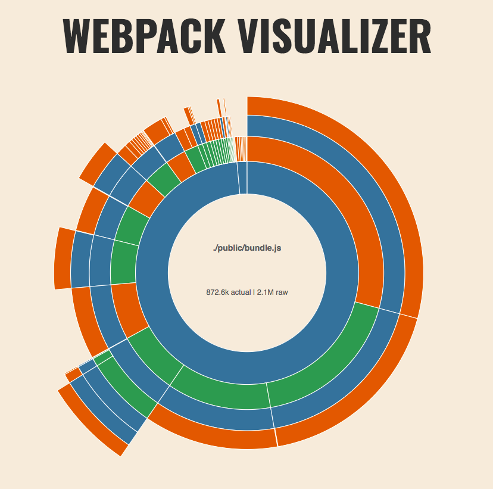

# Why

This is an exercise to explore the real world performance improvements from simply using unpkg for bundling popular packages rather than shipping a megabundle. Inspired by Michael Jackson's 2017 React Rally talk: <https://www.youtube.com/watch?v=2rhkgB8Cohc>

# Methodology

We put together a single page site that has a bunch of elements that might be found on a modern landing page. This would include popular libraries like

* Bootstrap
* Tippy (for nice hover)
* Video.js (for video playback)
* Flickity (for carousel)
* Leaflet (for maps)
* Masonry (for photos)

All together the minified Javascript for this came up to 873kb:

