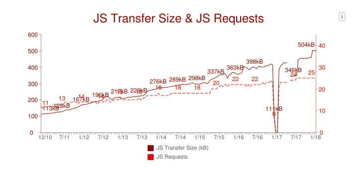

# Why

This is an exercise to explore the real world performance improvements from simply using unpkg for bundling popular packages rather than shipping a megabundle. Inspired by Michael Jackson's 2017 React Rally talk: <https://www.youtube.com/watch?v=2rhkgB8Cohc>

# But really, Why?

Our web apps, developed on localhost, constantly bump up against [Real World Web Performance Budgets](https://infrequently.org/2017/10/can-you-afford-it-real-world-web-performance-budgets/) when deployed.

* 45% of mobile connections occur over 2G
* 75% of mobile connections are over 2G or 3G

Alex Russell's recommended constraints:

* <5s first load TTI
* 400kbps link with 400ms RTT

This translates to ~130kb of critical resources, including JS. [>70% of websites are over this limit](http://httparchive.org/interesting.php)

Average JS per page:

* Nov 2010: 113kb
* Nov 2016: 420kb

Other real sites:

* Squarespace.com WYSIWYG client: 3mb
* Facebook.com: 2.1mb
* [GraphQL Tutorial](https://graphql-of-thrones.herokuapp.com/) (bundles GraphiQL): 1.5mb
* Youtube.com: 902kb
* Reddit.com: 890kb
* [Ecommerce site](https://puppybasket.herokuapp.com/): 826kb
* Twitter.com: 579kb
* Squarespace.com site: 506kb
* Google.com: 327kb
* Amazon.com: 307kb

The very minimalist webapp included here is **189kb** (bundled with the big bundle methodology), 61kb gzipped.

Swapping dependencies out for CDN resouces brings this down to **5kb**.

Using the platform means: HTTP/2 concurrent load and clientside caching of CDN resources.

# Methodology

We put together a single page site that has a bunch of libraries that might be found on a modern react app. This would include popular libraries like

* redux
* redux thunk
* react-redux
* axios
* react-router

All together the minified Javascript for this came up to 189kb.

Once we load these commonly used libraries from a CDN (using [dynamic-cdn-webpack-plugin](https://github.com/mastilver/dynamic-cdn-webpack-plugin), it is just a few lines), the bundle size falls to 5kb.

With the parallel loading of Http/2 and caching of modern browsers that have visited other sites that have these packages, the load times should be significantly faster for only a few minutes of work.

These are of course very small wins. Further easy wins are:

* [code splitting your routes](https://reacttraining.com/react-router/web/guides/code-splitting)
* [code splitting via webpack](https://webpack.js.org/guides/code-splitting/) in particular making a `vendors.js` for bundling dependencies without relying on a CDN.
* Use [webpack bundle visualizer](https://github.com/chrisbateman/webpack-visualizer) to see where your biggest imports are. Sometimes you can import specific modules instead of entire libraries.

# More reading

* <https://infrequently.org/2017/10/can-you-afford-it-real-world-web-performance-budgets/>
* <https://css-tricks.com/front-end-performance-checklist/> (this is [a nicer version on smashing magazine](https://www.smashingmagazine.com/2018/01/front-end-performance-checklist-2018-pdf-pages/))
* img and css wins <https://css-tricks.com/case-study-boosting-front-end-performance/>
